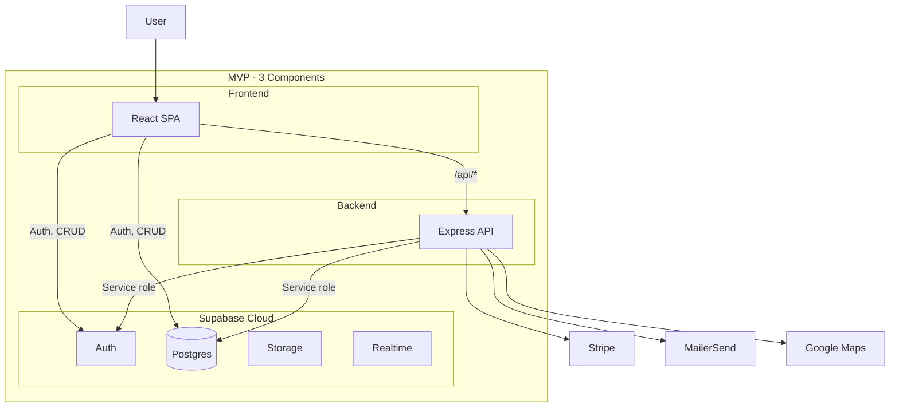
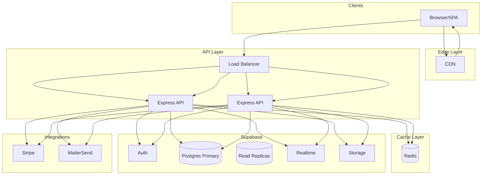

# Rental City – Supabase Architecture

## Overview

Rental City is a tenant–landlord matching platform. Supabase provides Postgres, Auth, Storage, and Realtime. A custom Node.js backend handles Plaid, SmartMove, Stripe, MailerSend, and Google Maps.

---

## Architecture Tiers

This document describes two architecture tiers:

- **MVP** — Minimal stack for validating the product and early users.
- **Scalable to Millions** — Evolved stack for high traffic, reliability, and global scale.

---

## MVP Architecture

MVP uses three components: React SPA, Express API, and Supabase Cloud. No CDN, load balancer, Redis, or queues.


### MVP Components

| Layer | Component | Role |
|-------|-----------|------|
| **Frontend** | React + Vite | SPA, auth UI, browse properties, applications |
| **Backend** | Express (single instance) | Integrations: Stripe, MailerSend, Maps |
| **Data & Auth** | Supabase Cloud | Auth, Postgres, Storage, Realtime |

### MVP Scope

| In scope | Out of scope |
|----------|--------------|
| Supabase Auth (email signup/login) | OAuth, SSO |
| Profiles (tenant/landlord) | Plaid, SmartMove |
| Property listings (CRUD) | Advanced search/filters |
| Tenant applications | Credit/background checks |
| Basic messaging (Supabase Realtime) | Email digests |
| Stripe application fee | Full payment/subscription flows |
| Essential API routes | Queue workers, caching layer |

### MVP Data Flow

1. **Auth** — SPA → Supabase Auth (direct)
2. **CRUD** — SPA → Supabase Postgres (direct, RLS enforced)
3. **Integrations** — SPA → Express → Stripe / MailerSend / Maps
4. **Messaging** — SPA → Supabase Realtime (direct)

### MVP Deployment

| Component | Hosting |
|-----------|---------|
| React SPA | Vercel / Netlify |
| Express API | Railway / Render / Fly.io |
| Supabase | Supabase Cloud |

### MVP Mermaid Diagram



---

## Scalable to Millions Architecture

At scale, the stack adds CDN, load balancing, Redis, read replicas, and queue workers.


### Scale Components

| Component | Scaling Approach | Millions-of-Users Implications |
|-----------|------------------|--------------------------------|
| **CDN** | Edge caching for static assets | Offloads most asset traffic from origin |
| **React SPA** | Edge deploy (Vercel, Cloudflare Pages) | Global edge nodes, low TTFB |
| **Load Balancer** | Distribute across N API instances | Scale horizontally with traffic |
| **Express API** | Stateless, horizontal scaling | Add instances behind LB; auto-scale on CPU/memory |
| **Redis** | Cluster / sharding | Sessions, hot cache; reduces DB hits |
| **Supabase Postgres** | Primary + read replicas, connection pooling | Writes to primary; reads from replicas; pooler limits connections |
| **Realtime (WebSocket)** | Supabase-managed pool | Supabase scales WebSocket nodes; monitor per-connection limits |
| **Storage** | S3-compatible + CDN | Object storage scales; CDN for media delivery |
| **Auth** | Supabase Auth (JWT) | Stateless; scales with managed service |
| **Integrations** | Queue workers for async processing | Decouple API from Stripe/MailerSend; handle bursts |

### Scale Bottlenecks & Mitigations

| Bottleneck | Mitigation |
|------------|------------|
| **DB connections** | PgBouncer or Supabase pooler; limit connections per API instance |
| **DB write capacity** | Partition heavy tables (messages, notifications); consider event sourcing for audit logs |
| **Realtime connections** | Room-based subscriptions; prune inactive users; consider dedicated Realtime infra at very high scale |
| **API compute** | Offload geocoding, PDF generation, heavy processing to queue workers |
| **External API limits** | Rate limiting, retries, circuit breakers; queue non-urgent calls |
| **Auth token verification** | Cache JWT validation in Redis to reduce calls to Supabase Auth |

### Scale Mermaid Diagram



### Evolution Path (MVP → Scale)

1. **Edge** — Add CDN for static assets; optionally edge functions for auth checks.
2. **Compute** — Deploy multiple Express instances behind a load balancer.
3. **Cache** — Add Redis for sessions and hot data.
4. **DB** — Enable read replicas and connection pooling.
5. **Async** — Introduce queue (e.g. Bull/BullMQ) for emails, payments, screenings.
6. **Observability** — Add metrics and tracing (e.g. Prometheus, Datadog).

---

## Supabase Access Patterns: Direct vs Via Backend

There are two ways the application talks to Supabase.

| Path | Flow | Use Case | Why |
|------|------|----------|-----|
| **Direct** | SPA → Supabase | Auth, Postgres CRUD, Realtime, Storage | Supabase client uses user JWT; RLS enforces permissions |
| **Indirect** | SPA → Express → Supabase | Stripe, MailerSend, Maps, server-only logic | Server uses service role; secrets stay server-side |

### What Uses Which Path

| Operation | Path |
|-----------|------|
| Sign up / sign in | Direct (Supabase Auth) |
| Load profiles, properties, applications | Direct (Supabase + RLS) |
| Send / load messages | Direct (Supabase Realtime + Postgres) |
| Apply to property (Stripe fee) | Indirect (API → Stripe + Supabase) |
| Send email (MailerSend) | Indirect (API → MailerSend) |
| Geocode address (Maps) | Indirect (API → Maps) |
| Process Stripe webhooks | Indirect (API only) |

The backend is not a mandatory proxy for Supabase. It is used only for operations that require server-side secrets or elevated privileges.

---

## Supabase: Cloud vs Self-Hosted

**Recommendation: Supabase Cloud for MVP and early scaling.**

| Option | Description | Who Manages |
|--------|-------------|-------------|
| **Supabase Cloud** | Hosted by Supabase | Supabase (Postgres, Auth, Storage, Realtime, backups, upgrades) |
| **Self-hosted** | You run Supabase (Docker, K8s) | You manage servers, Postgres, backups, scaling |

### Supabase Cloud Benefits

- Quick setup (create project, get URL + keys)
- No ops burden for Postgres, Auth, Realtime
- Free tier, then predictable paid plans
- Built-in scaling, backups, and monitoring

### When Self-Hosted Makes Sense

- Compliance or data residency (e.g. on-prem, specific regions)
- Very high scale where infra cost dominates
- Strong need to own the entire stack

Use Supabase Cloud unless there is a clear requirement for self-hosting.

---

## User Types & Screen-Mapped Backend Logic

### Tenant

| Screen / Flow | Backend Logic | Data / Permissions |
|---------------|---------------|--------------------|
| Onboarding | `profiles` insert/update, `tenant_preferences` | Tenant can write own profile and preferences |
| Leasing preferences | `tenant_preferences` CRUD | RLS: `auth.uid() = user_id` |
| Browse property matches | `properties` + `tenant_preferences` filter | RLS: public read for active listings |
| Apply to listings | `applications` insert, Stripe fee | Tenant writes own application; fee via custom backend |
| Message landlords | `messages` insert, Realtime | RLS: participant can read/write own messages |
| Application profile | `profiles`, `applications` read | Own data only |
| Notifications | `notifications` read/update | RLS: `user_id = auth.uid()` |
| Delete account | Auth + cascade delete | Custom endpoint + triggers |

### Landlord

| Screen / Flow | Backend Logic | Data / Permissions |
|---------------|---------------|--------------------|
| Create profile | `profiles` insert/update | Landlord writes own profile |
| Add/manage listings | `properties` CRUD | RLS: `landlord_id = auth.uid()` |
| Review tenant matches | `applications` read, `tenant_preferences` | Landlord sees applications for own properties |
| Message applicants | `messages` insert, Realtime | RLS: participant can read/write |
| Account settings | `profiles` update | Own profile only |
| Report tenants | `reports` insert | Landlord can create reports |
| Tenant ratings (private) | `tenant_ratings` read | Landlord-only view |

### Admin

| Screen / Flow | Backend Logic | Data / Permissions |
|---------------|---------------|--------------------|
| Dashboard | Aggregation queries | Admin role; `is_admin` check |
| User management | `profiles` CRUD, suspend/delete | Admin-only RLS policies |
| Reported issues | `reports` read, moderation actions | Admin can update status, suspend users |
| System notifications | `notifications` CRUD | Admin can create platform-wide notifications |
| Account settings | `profiles` update | Own profile |

---

## Database Schema

### Core Tables

```
auth.users (Supabase managed)
    └── profiles (extends users)
    └── tenant_preferences
    └── properties
    └── applications
    └── messages
    └── notifications
    └── reports
    └── tenant_ratings
    └── payments
```

### Tables Detail

| Table | Purpose |
|-------|---------|
| `profiles` | User metadata, role (tenant/landlord/admin), display info |
| `tenant_preferences` | Budget, location, bedrooms, move-in date, etc. |
| `properties` | Address, geocode, amenities, landlord_id, status |
| `applications` | Tenant → property, status, screening_id, payment_id |
| `messages` | Thread between tenant and landlord |
| `notifications` | In-app notifications per user |
| `reports` | Landlord reports on tenants; admin moderation |
| `tenant_ratings` | Landlord-only ratings of past tenants |
| `payments` | Stripe payment records linked to applications |

---

## Row Level Security (RLS)

| Table | Tenant | Landlord | Admin |
|-------|--------|----------|-------|
| `profiles` | Own row | Own row | All |
| `tenant_preferences` | Own rows | — | All |
| `properties` | Read active | Own CRUD | All |
| `applications` | Own CRUD | Read for own properties | All |
| `messages` | Own threads | Own threads | All |
| `notifications` | Own | Own | All + create system |
| `reports` | — | Create | Read, update status |
| `tenant_ratings` | — | Read/create | All |
| `payments` | Own | Own properties | All |

---

## Custom Backend Architecture

### Why a Dedicated Server

- **Plaid**: Secure bank linking, income verification (server-only)
- **SmartMove**: Credit/criminal/eviction checks (server-only)
- **Stripe**: Webhooks, idempotent payment handling
- **MailerSend**: Transactional emails (API keys server-side)
- **Google Maps**: Geocoding, distance (API key server-side)
- **Data transformation**: Enrich/filter data before returning to client
- **Regional deployment**: Deploy backend in target region (e.g. US-East)

### Scalability

- **Vertical**: Scale server instance (CPU/RAM)
- **Horizontal**: Multiple instances behind load balancer; Supabase handles DB scaling
- **Edge**: Supabase Edge Functions for lightweight, low-latency tasks

---

## Integrations

| Integration | Purpose | Backend |
|------------|---------|---------|
| Google Maps | Address validation, geocoding, distance | Custom server |
| Plaid (optional) | Income verification | Custom server |
| SmartMove (TBD) | Tenant screening | Custom server |
| Stripe | Application fees, receipts | Custom server + webhooks |
| MailerSend | 5 transactional triggers | Custom server |
| Termly | Privacy Policy, Terms of Service | Frontend embed |

---

## Auth Flow

1. Supabase Auth: sign up / sign in (email, OAuth later)
2. `profiles` row created via trigger on `auth.users` insert
3. Role set during onboarding (tenant vs landlord)
4. JWT passed to custom backend; validated via Supabase `verifyToken` or `getUser`

---

## File Structure

```
RentalCity/
├── client/                 # React + Vite
│   ├── src/
│   │   ├── components/
│   │   ├── pages/
│   │   ├── lib/supabase.ts
│   │   └── types/
│   └── vite.config.ts
├── server/                 # Express custom backend
│   ├── index.ts
│   ├── routes/
│   │   ├── plaid.ts
│   │   ├── stripe.ts
│   │   ├── mailer.ts
│   │   └── maps.ts
│   └── middleware/auth.ts
├── supabase/
│   ├── migrations/
│   └── config.toml
├── docs/
│   └── ARCHITECTURE.md
├── package.json
└── .env.example
```

---

## Next Steps

1. Run `supabase init` and create migrations for schema above
2. Implement RLS policies per table
3. Scaffold client (React) and server (Express)
4. Add `.env.example` and wire Supabase client
5. Implement Stripe, MailerSend, and Google Maps endpoints
6. Add Plaid and SmartMove when ready
